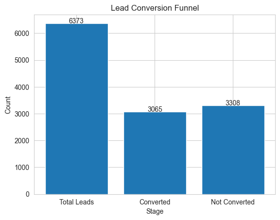
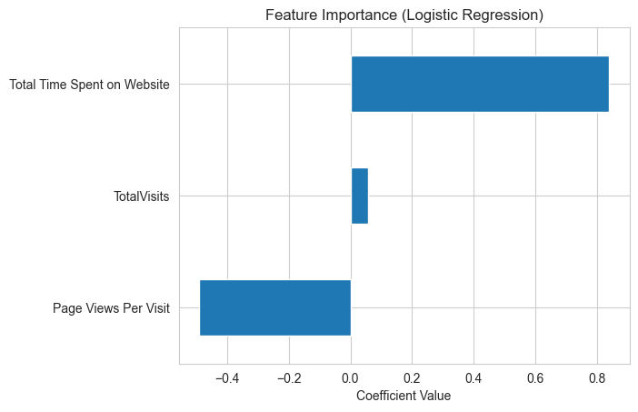
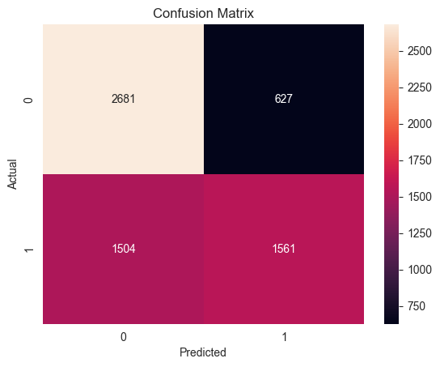
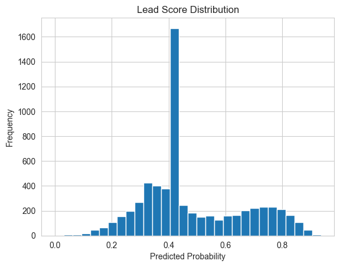

# 🎯 Lead Scoring Case Study
> 📌 Built a machine learning model to help sales teams prioritize high-conversion leads and improve efficiency.

## 🧠 Problem Statement
X Education is facing a low lead conversion rate (~30%).  
The goal of this project is to identify high-quality leads and improve conversion efficiency.

---

## 📊 Project Overview
This project analyzes historical lead data and builds a predictive model to estimate the probability of conversion.

Using Exploratory Data Analysis (EDA) and machine learning techniques, we identify key factors that influence whether a lead converts or not.

---

## 🛠️ Tech Stack
- Python (Pandas, NumPy)
- Data Visualization (Matplotlib, Seaborn)
- Machine Learning (Scikit-learn)
- Jupyter Notebook

---

## ⚙️ Approach
- Performed data cleaning and preprocessing on raw lead data
- Conducted EDA to understand patterns and relationships
- Built a **Logistic Regression model** to predict lead conversion
- Evaluated model performance using accuracy and classification metrics

---

## 📈 Results
- Achieved ~80% prediction accuracy
- Model demonstrates strong ability to distinguish high vs low probability leads
- Balanced performance with good precision and recall

➡️ This ensures sales teams can reliably prioritize high-quality leads while minimizing missed opportunities.

---

## 💡 Business Insights

- Leads from certain sources have significantly higher conversion rates
- Higher engagement (time spent, activity) strongly increases conversion probability
- Low-quality leads can be filtered early to save sales effort

## 🚀 Conclusion
This project demonstrates how data-driven decision-making can optimize sales strategies and improve business outcomes.

## 📸 Visual Insights

### 📊 Conversion Funnel

  

➡️ Insight: Only ~30% of leads convert, highlighting inefficiency in current sales targeting.

### 📈 Feature Importance

  

➡️ Insight: Lead source and user engagement are the strongest predictors of conversion.

### 🎯 Confusion Matrix

  

➡️ Insight: The model performs well in identifying high-quality leads, reducing wasted sales effort.

### 📉 Lead Score Distribution

  

➡️ Insight: Clear separation between high-probability and low-probability leads enables prioritization.

---

## 🤔 My Approach
- Focused on interpretability (Logistic Regression)
- Prioritized business usability over complex models

## 🔮 Future Improvements
- Try advanced models (Random Forest, XGBoost)
- Deploy as a real-time scoring API
